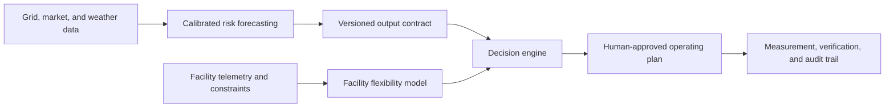

# Meridian

**Grid-flexibility software for data centers.**

[](https://meridian.kianfoshee.com)

Meridian is a decision-support system for data-center demand flexibility. It forecasts when grid conditions may tighten, evaluates a facility's approved operating constraints, and produces a response plan for an operator to review.


## System architecture



## What I built

- An ERCOT forecasting pipeline for physical grid tightness from one to four days ahead.
- A facility model covering load, cooling, storage, workload, contract, and recovery constraints.
- A human-in-the-loop console for planning, event response, and post-event verification.
- ERCOT and LADWP market adapters behind one versioned output contract.
- Point-in-time validation, explicit abstention, immutable releases, and hash-chained evidence ledgers.

## Stack

| Layer             | Technology                                                                    | Why it was chosen                                                                                     |
| ----------------- | ----------------------------------------------------------------------------- | ----------------------------------------------------------------------------------------------------- |
| Product interface | Next.js 16, React 19, TypeScript, Tailwind CSS                                | A typed UI with server and client rendering in one codebase                                           |
| Hosting           | Vercel for product deployments; GitHub Pages for this showcase                | Preview deployments, edge delivery, and reproducible static publishing                                |
| API               | Python, FastAPI, Pydantic                                                     | Typed contracts and a small, testable service boundary                                                |
| Data pipeline     | Polars, PyArrow, Parquet, DuckDB                                              | Efficient analytical processing of large, time-indexed archives without operating a database server   |
| Modeling          | scikit-learn; PyTorch for research experiments                                | Interpretable baselines, calibrated gradient boosting, and controlled comparison with sequence models |
| Data sources      | ERCOT public data, NOAA GFS/GEFS, Open-Meteo, EIA, and public utility records | Primary-source grid, weather, and market inputs with explicit publication vintages                    |
| Operational state | Append-only, hash-chained JSONL ledgers                                       | Reproducible histories of inputs, forecasts, decisions, and corrections                               |
| Development tools | Claude Code and OpenAI Codex                                                  | Implementation assistance, test generation, and adversarial review                                    |

## Engineering decisions

- **No random train/test split.** Grid events cluster in time, so models are evaluated with walk-forward folds and data as it existed at each forecast cut.
- **No silent imputation.** Missing or stale inputs produce an explicit degraded or abstaining state.
- **No LLM in the decision path.** Operational probabilities come from calibrated statistical models. AI coding tools were used for implementation and review.
- **No automatic control.** The console is advisory; an authenticated operator remains responsible for approval.

## Current status

Historical validation is strongest for broad physical grid tightness. Operator actions are much rarer, so those estimates remain provisional. Facility-specific instructions and deliverable megawatts cannot be validated without a design partner's records. Meridian is therefore operated in shadow mode while prospective evidence accumulates.

## Public repository scope

This repository contains the public product interface and a technical overview. The forecasting pipeline, model artifacts, facility optimizer, customer connectors, operational configuration, and partner data are private.

## Run the public interface

```bash
pnpm install
pnpm dev
```

Then open [http://localhost:3000](http://localhost:3000).

Before committing, run the complete quality gate:

```bash
pnpm check
```

This runs linting, TypeScript validation, formatting checks, and a production build.

---

Built by [Kian Foshee](https://www.linkedin.com/in/kianfoshee/).
