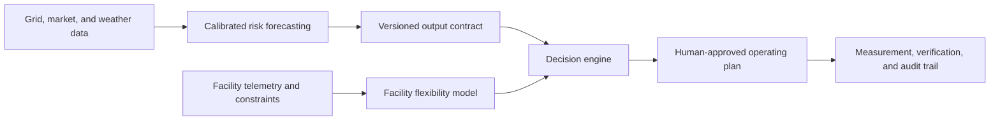

# Meridian

**Grid-flexibility software for data centers.**

[Live product site](https://meridian.kianfoshee.com)

Meridian is designed to help data centers turn electrical flexibility into an operating resource. It combines grid and weather forecasts with a facility's approved constraints to answer three questions: when the grid may become tight, how much load the facility can safely shift, and which human-approved response plan best protects reliability and economics.


## System architecture



The current system includes:

- An ERCOT forecasting pipeline for physical grid tightness from one to four days ahead.
- A facility model that evaluates load, cooling, storage, workload, contractual, and recovery constraints.
- A human-in-the-loop operator console for planning, event response, and post-event verification.
- Market adapters for ERCOT and an emerging LADWP readiness layer.
- Time-ordered validation, explicit abstention, immutable model releases, and hash-chained evidence ledgers.

## Stack

| Layer | Technology | Why it was chosen |
| --- | --- | --- |
| Product interface | Next.js 16, React 19, TypeScript, Tailwind CSS | Fast typed product development with server and client rendering in one codebase |
| Hosting | Vercel for product deployments; GitHub Pages for this public showcase | Simple previews, edge delivery, and reproducible static publishing |
| API | Python, FastAPI, Pydantic | Typed contracts and a small, testable service boundary |
| Data pipeline | Polars, PyArrow, Parquet, DuckDB | Efficient analytical processing of large, time-indexed archives without operating a database server |
| Modeling | scikit-learn; PyTorch for research experiments | Interpretable baselines, calibrated gradient boosting, and controlled comparison with sequence models |
| Data sources | ERCOT public data, NOAA GFS/GEFS, Open-Meteo, EIA, and public utility records | Primary-source grid, weather, and market inputs with explicit publication vintages |
| Operational state | Append-only, hash-chained JSONL ledgers | Reproducible histories of inputs, forecasts, decisions, and corrections |
| Development tools | Claude Code and OpenAI Codex | Implementation assistance, test generation, and adversarial review; no LLM produces the operational forecast |

## Validation philosophy

Energy events are rare and grid data is revised after publication, so ordinary random train/test splits would overstate performance. Meridian uses time-ordered walk-forward evaluation, point-in-time data vintages, calibrated probabilities, explicit comparison with public-data baselines, and refusal states when required inputs or evidence are missing.

The strongest current evidence is historical forecasting of broad physical grid tightness. Operator-action prediction remains limited by rare events, while facility-specific instructions and deliverable megawatts require real partner records. The console therefore operates in advisory shadow mode: it does not control equipment or treat a forecast as authorization to curtail.

## Public repository scope

This repository intentionally contains the public product interface and technical overview. The production forecasting pipeline, trained artifacts, facility-optimization logic, customer connectors, operational configuration, and partner data remain private. Synthetic examples and selected technical components may be published here over time without exposing customer information or proprietary operating logic.

## Run the public interface

```bash
pnpm install
pnpm dev
```

Then open `http://localhost:3000`.

---

Built by [Kian Foshee](https://www.linkedin.com/in/kianfoshee/).
